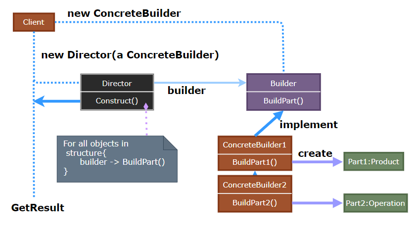
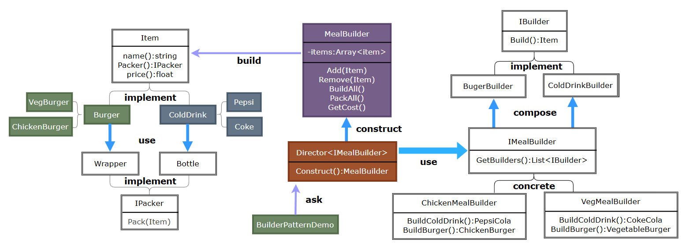

### Builder

建造者模式 (Builder) 使用多个简单的对象一步一步构建成一个复杂的对象。Builder 将一个复杂的构建与其表示相分离，使得同样的构建过程可以创建不同的表示。

- Builder：为创建一个 Product 对象的各个部件指定抽象接口。
- ConcreteBuilder：实现 Builder 的接口以构造和装配该产品的各个部件，定义并明确它所创建的表示，提供一个使用 Builder 接口的对象。
- Director：构造一个使用 Builder 接口的对象。
- Product：表示被构造的复杂对象，ConcreteBuilder 创建该产品的内部表示并定义它的装配过程，product 包含定义组成部件的类，包括将这些部件装配成最终产品的接口。

> **设计要点**

1. Builder 主要用于 “分步骤构建一个复杂的对象” 在这其中 “分步骤” 是一个稳定的算法，而复杂对象的各个部分则经常变化。
2. 变化点在哪里，封装哪里。Builder 主要在于应对 “复杂对象各个部分” 的频繁需求变动。其缺点在于难以应对 “分步骤构建算法” 的需求变动。
3. AbstractFactory 与 Builder 相似，都可以创建复杂对象。主要的区别是 Builder 着重于一步步构造一个复杂对象，AbstractFactory 着重于多个系列的产品对象；Builder 在最后一步返回产品，AbstractFactory 的产品是立即返回的。
4. Composite 通常是用 Builder 生成的。

> **案例实现**

假设一个快餐店的商业案例，一个典型的套餐可以是一个汉堡 (Burger) 和一杯冷饮 (Cold drink)。汉堡 (Burger) 可以是素食汉堡 (Veg Burger) 或鸡肉汉堡 (Chicken Burger)，它们是包在纸盒中。冷饮 (Cold drink) 可以是可口可乐 (coke) 或百事可乐 (pepsi)，它们是装在瓶子中。

  
  
  
  
  
  
  

---