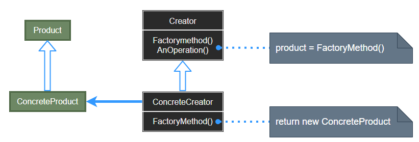
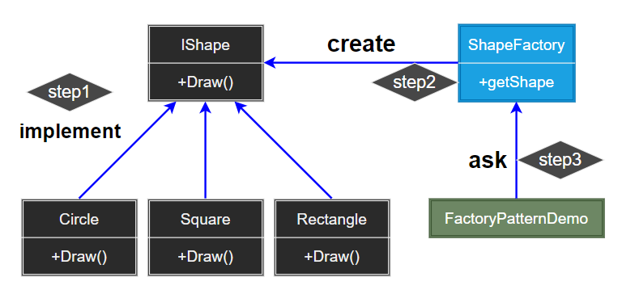

## Factory Pattern

工厂模式 (Factory) 定义一个用于创建对象的接口，让子类决定实例化哪一个类。主要解决接口选择问题，将对象创建延迟到子类。Factory 提供 "封装机制" 隔离易变对象，保持其他依赖对象不随需求改变。

  

- Product：定义工厂方法所创建的对象的接口。
- ConcreteProduct：实现 Product 接口。
- Creator：声明工厂方法，该方法返回一个 Product 类型的对象。Creator 也可定义一个工厂方法的缺省实现，它返回一个缺省的 ConcreteProduct 对象；通过调用工厂方法以创建一个 Product 对象。Creator 依赖于它的子类来定义工厂方法，所以它返回一个适当的 ConcreteProduct 实例。
- ConcreteCreator：重定义工厂方法以返回一个 ConcreteProduct 实例。

> **设计要点**

1. Factory Method 模式主要用于隔离类对象的使用者和具体类型之间的耦合关系。面对一个经常变化的具体类型，紧耦合关系会导致软件的脆弱。
2. Factory Method 模式通过面向对象的手法，将所要创建的具体对象工作延迟到子类，从而实现一种扩展 (而非更改) 的策略，较好地解决了这种紧耦合关系。
3. Factory Method 模式解决 “单个对象” 的需求变化，AbstractFactory 模式解决 “系列对象” 的需求变化，Builder 模式解决 “对象部分” 的需求变化。
4. Factory Method 模式表示将对象的变种通过一个入口 (生产的工厂) 进入，进入的钥匙则是具体的对象变种 (或者说是抽象对象的继承子类，即汽车下面的大众车，丰田车)，而整体程序的主框架不会发生大的改变 (对车的性能测试功能并没有进行太大的改动)。

> **案例实现**

创建一个 IShape 接口和实现 Shape 接口的实体类，定义工厂类 ShapeFactory。FactoryDemo 将向 ShapeFactory 传递信息 (CIRCLE / RECTANGLE / SQUARE) ，以便获取它所需对象的类型。

> **案例示意**

  
  
  
  
  
  
  

---