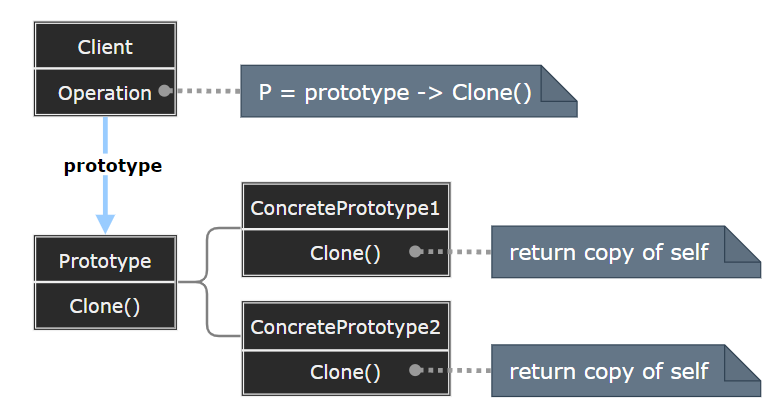
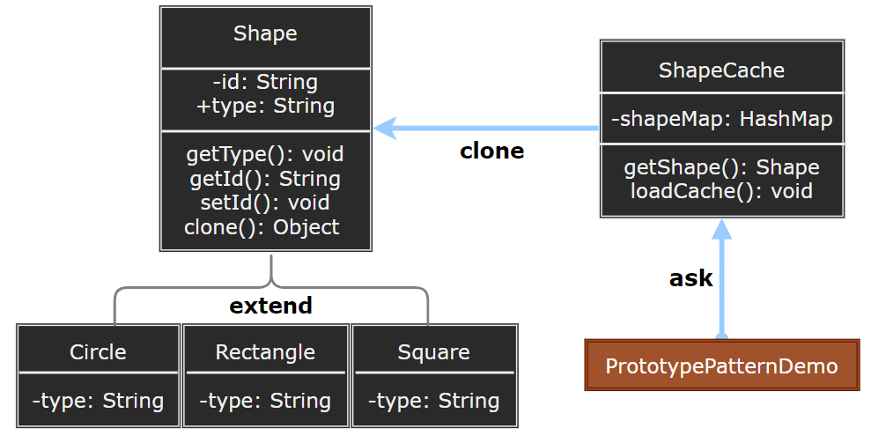

## Prototype Pattern

原型模式 (Prototype) 在保持性能的同时，用于创建重复对象。用原型实例指定创建对象的种类，并且通过拷贝这些原型快速创建新的对象。



- Prototype：声明一个克隆自身的接口。
- ConcretePrototype：实现一个克隆自身的操作。
- Client：让一个原型克隆自身从而创建一个新的对象。

> **设计要点**

- Prototype 模式同样用于隔离类对象的使用者和具体类型 (易变类) 之间的耦合关系，它同样要求这些 “易变类” 拥有 “稳定的接口”。
- Prototype 模式对于 “如何创建易变类的实体对象” 采用 “原型克隆” 的方法来做，它使得我们可以非常灵活地动态创建 “拥有某些稳定接口” 的新对象——所需工作仅仅是注册一个新类的对象 (即原型)，然后在任何需要的地方不断地 Clone。
- Prototype 模式中的 `Clone` 方法可以利用，例如 C# 中的 `Object.MemberwiseClone` 方法浅拷贝或者序列化来实现深拷贝。

> **案例实现**

创建一个抽象类 Shape 和扩展了 Shape 类的实体类。下一步是定义类 ShapeCache，该类把 shape 对象存储在一个 Hashtable 中，并在请求的时候返回它们的克隆。演示类使用 ShapeCache 类来获取 Shape 对象。

> **案例示意**

  

<p align="left">
  <a href="../DP_examples/CSharp/01_Creational/Prototype/Client.cs"></a>
  <a href="../DP_examples/C/01_Creational/Prototype/client.c"></a>
  <a href="../DP_examples/C++/01_Creational/Prototype/Client.cpp"></a>
  <a href="../DP_examples/Lua/01_Creational/Prototype/Client.lua"></a>
  <a href="../DP_examples/Go/01_Creational/Prototype/Client_test.go"></a>
  <a href="../DP_examples/Python/01_Creational/Prototype/Client.py"></a>
  <a href="../DP_examples/Rust/01_Creational/Prototype/main.rs"></a>
</p>

>---

### CSharp 中的深拷贝与浅拷贝

#### 浅拷贝

```csharp
    public class WiseCloneDemo
    {
        WiseCloneDemo wiseClone;
        public WiseCloneDemo WiseClone()
        {
            WiseCloneDemo wise = null;
            if (wiseClone == null)
                wiseClone = new WiseCloneDemo();
            try
            {
                wise = wiseClone.MemberwiseClone() as WiseCloneDemo;
            }
            catch (Exception e)
            {
                Console.WriteLine("[ WiseClone Failed ]:" + e.Message);
            }
            return wise;
        }
    }
```

#### 深拷贝

> 二进制流

```csharp
    // 使用二进制流进行 对象深拷贝, 要求对象必须具有[Serializable]属性
    public static T CloneObject<T>(this T source) where T : class
    {
        if (!typeof(T).IsSerializable)
            throw new ArgumentException("The type must be Serializable.", "source");
        if (Object.ReferenceEquals(source, null))
            return default(T);
        IFormatter formatter = new BinaryFormatter();
        Stream stream = new MemoryStream();
        using (stream)
        {
            formatter.Serialize(stream, source);
            stream.Seek(0, SeekOrigin.Begin);
            stream.Close();
            return (T)formatter.Deserialize(stream);
        }
    }
    
```

> 序列化与反序列化

```csharp
    // using Newtonsoft.Json;
    // 利用序列化与反序列化进行 对象深拷贝
    public static T serializerClone<T>(this T source) where T : class
    {
        if (Object.ReferenceEquals(source, null))
            return default(T);
        JsonSerializerSettings serializerSettings = new JsonSerializerSettings
        {
            ObjectCreationHandling = ObjectCreationHandling.Replace
        };
        return JsonConvert.DeserializeObject<T>(JsonConvert.SerializeObject(source), serializerSettings);
    }
```

> 反射

```csharp
    /// 利用反射进行 对象深拷贝
    public static T ReflectClone<T>(this T source) where T : class
    {
        if (source is string || source.GetType().IsValueType)
        {
            return source;
        }
        object retval = Activator.CreateInstance(source.GetType());
        FieldInfo[] fields = source.GetType().GetFields(BindingFlags.Public 
            | BindingFlags.NonPublic | BindingFlags.Instance | BindingFlags.Static);
        foreach (FieldInfo item in fields)
        {
            try
            {
                item.SetValue(retval, ReflectClone(item.GetValue(source)));
            }
            catch (Exception)
            {
                Console.WriteLine("ReflectClone failed");
            }
        }
        return (T)retval;
    }
```

> XML 序列化

```csharp
    /// 利用XML序列化进行 对象深拷贝
    public static T xmlSerClone<T>(this T source) where T : new()
    {
        T docItms = new T();
        using (MemoryStream ms = new MemoryStream())
        {
            XmlSerializer xms = new XmlSerializer(docItms.GetType());
            xms.Serialize(ms, source);
            ms.Seek(0, SeekOrigin.Begin);
            docItms = (T)xms.Deserialize(ms);
            ms.Close();
        }
        return docItms == null ? default(T) : docItms;
    }
```

> DataContractSerializer 序列化

```csharp
    /// 利用 DataContract 序列化进行 对象深拷贝
    public static T DataSerClone<T>(this T source) where T : new()
    {
        T docItms = new T();
        using (MemoryStream ms = new MemoryStream())
        {
            DataContractSerializer ser = new DataContractSerializer(docItms.GetType());
            ser.WriteObject(ms, source);
            ms.Seek(0, SeekOrigin.Begin);
            docItms = (T)ser.ReadObject(ms);
            ms.Close();
        }
        return docItms == null ? default(T) : docItms;
    }
```

---
