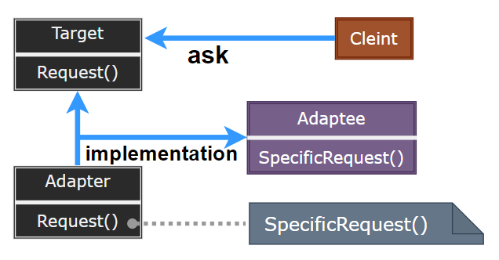
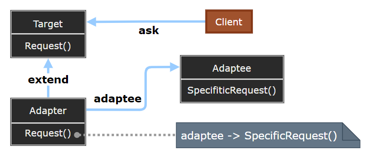
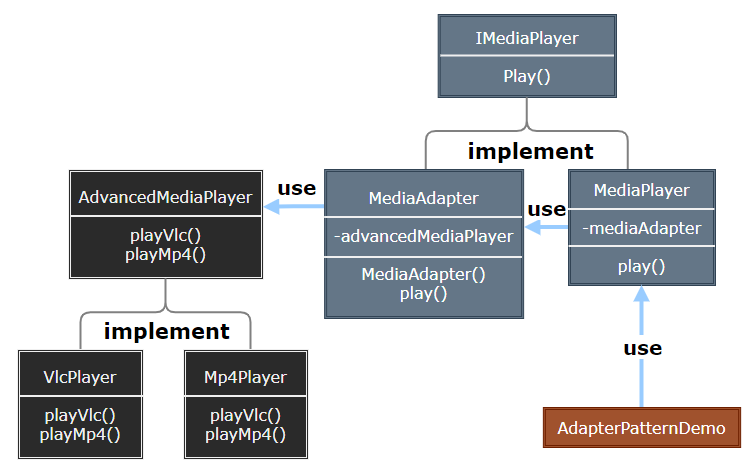

### Adapter

适配器模式（Adapter）作为两个不兼容接口之间的桥梁，将一个类的接口转换成客户端希望的另一个接口，使得原本由于接口不兼容而不能一起工作的类可以协同工作。

> 类适配模式

  

> 对象适配模式

  

- Target：定义客户端使用的与特定领域相关的接口。
- Client：与符合 Target 接口的对象协同。
- Adaptee：定义一个已经存在的接口，这个接口需要适配。
- Adapter：对 Adaptee 的接口与 Target 接口进行适配。

> **设计要点**

1. 适配器模式主要用于解决接口不兼容的问题，是一种 "事后补救" 的设计模式。
2. 类适配器使用继承，对象适配器使用组合，后者更灵活。
3. 过多使用适配器会增加系统复杂性，应优先考虑接口设计的一致性。

> **案例实现**

音频播放器设备只能播放 mp3 文件，通过适配器使用高级媒体播放器来播放 vlc 和 mp4 文件。

  

  
  
  
  
  
  
  

---