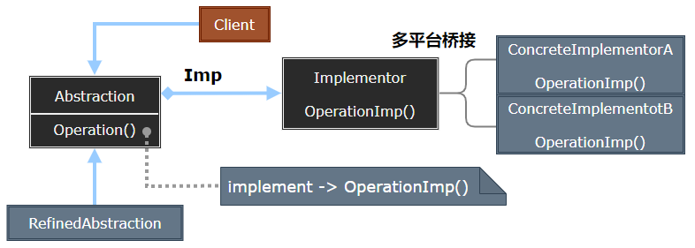
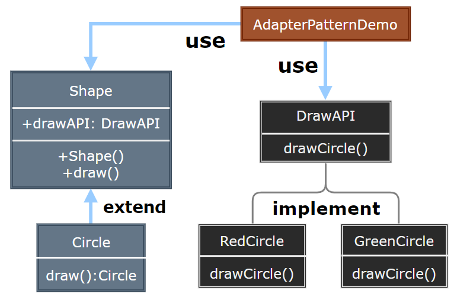

### Bridge

桥接模式（Bridge）将抽象部分与实现部分分离，使它们可以独立变化。它通过组合而不是继承来实现这种分离，从而减少了系统中的耦合度。

  

- Abstraction：定义抽象接口，维护对实现对象的引用。
- RefinedAbstraction：扩展 Abstraction 定义的接口。
- Implementor：定义实现接口，供 Abstraction 使用。
- ConcreteImplementor：实现 Implementor 接口的具体类。

> **设计要点**

1. 桥接模式适用于当一个类存在两个独立变化的维度，且这两个维度都需要扩展时。
2. 通过组合将抽象与实现分离，避免了类的爆炸式增长。
3. 抽象和实现可以独立演化，提高了系统的灵活性和可扩展性。

> **案例实现**

实现不同形状和颜色的组合，通过桥接模式将形状和颜色分离，使它们可以独立变化。

  

  
  
  
  
  
  
  

---