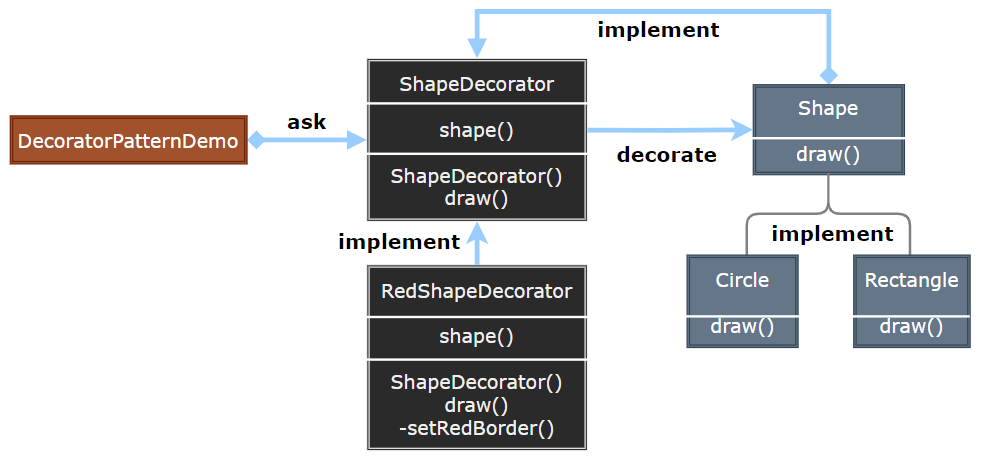

### Decorator

装饰器模式（Decorator）动态地给一个对象添加一些额外的职责，就增加功能而言，装饰器模式比生成子类更为灵活。

!\[装饰器模式]\(.img/装饰器模式设计.png null)

- Component：定义对象的接口，可以给这些对象动态添加职责。
- ConcreteComponent：定义具体的对象，Decorator 可以给它添加职责。
- Decorator：维护对 Component 的引用，并定义与 Component 一致的接口。
- ConcreteDecorator：向组件添加具体的职责。

> **设计要点**

1. 装饰器模式适用于需要动态地为对象添加功能，而又不影响其他对象的情况。
2. 通过组合而非继承的方式，实现了功能的扩展，避免了类的爆炸式增长。
3. 装饰器可以叠加使用，形成功能的组合。

> **案例实现**

为 Shape 添加一个装饰类，这个类用于在 Draw 和 Fill 的前后添加一些功能。

  
  
  
  
  
  
  

***

