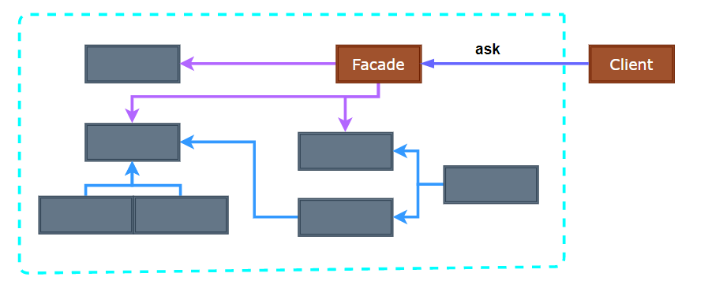
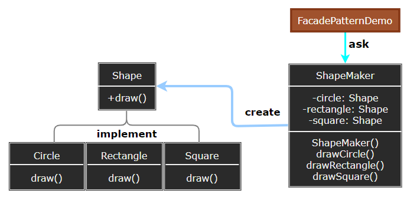

### Facade

外观模式（Facade）为子系统中的一组接口提供一个统一的高层接口，使得子系统更容易使用。

  

- Facade：为子系统提供一个统一的接口，将客户端的请求委派给适当的子系统对象。
- Subsystem Classes：实现子系统的功能，处理 Facade 委派的请求。

> **设计要点**

1. 外观模式适用于需要简化复杂子系统接口的情况，为客户端提供一个清晰、简洁的接口。
2. 降低了客户端与子系统之间的耦合度，使得子系统的变化不会影响客户端。
3. 可以根据需要创建多个外观类，每个外观类针对不同的客户端需求。

> **案例实现**

内部子系统有不同的图形生成接口，客户端通过外观模式统一调用。

  

  
  
  
  
  
  
  

---