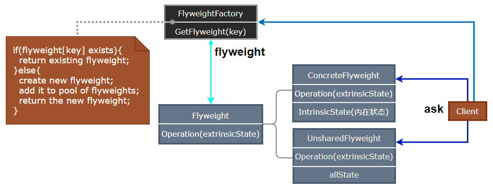
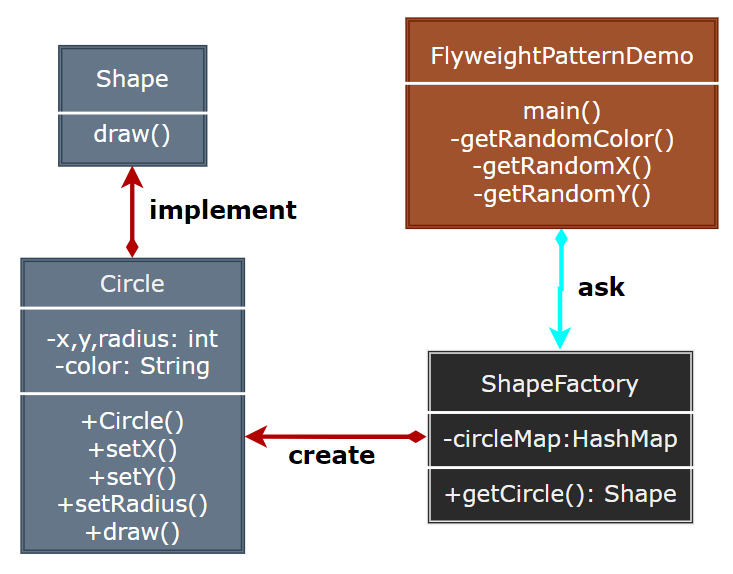

### Flyweight

享元模式（Flyweight）运用共享技术有效地支持大量细粒度对象的复用，减少创建对象的数量，节省内存空间。

  

- Flyweight：定义享元对象的接口，通过这个接口可以接受并作用于外部状态。
- ConcreteFlyweight：实现 Flyweight 接口，存储内部状态。
- FlyweightFactory：创建并管理享元对象，确保合理地共享享元对象。
- UnsharedConcreteFlyweight：不需要共享的享元对象。

> **设计要点**

1. 享元模式适用于需要创建大量相似对象的场景，通过共享内部状态来减少对象数量。
2. 将对象的状态分为内部状态和外部状态，内部状态可共享，外部状态由客户端维护。
3. 享元工厂负责管理享元对象的创建和复用，确保相同内部状态的对象只创建一次。

> **案例实现**

Shape 通过工厂模式生成不同直径、颜色、位置的 Circle，通过享元模式共享 CircleData，减少内存使用。

  

  
  
  
  
  
  
  

---