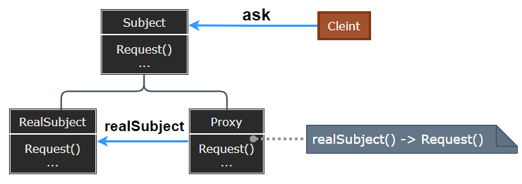
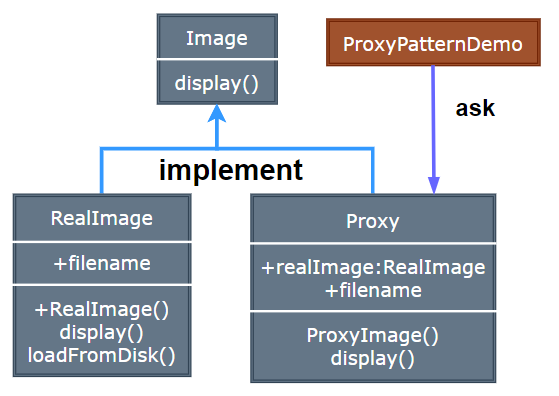

### Proxy

代理模式（Proxy）为其他对象提供一种代理以控制对这个对象的访问，在某些情况下，一个对象不适合或者不能直接引用另一个对象，而代理对象可以在客户端和目标对象之间起到中介的作用。

  

- Subject：定义 RealSubject 和 Proxy 的共同接口，这样在任何使用 RealSubject 的地方都可以使用 Proxy。
- RealSubject：定义 Proxy 所代表的真实对象。
- Proxy：保存一个引用使得代理可以访问实体，并提供一个与 Subject 接口相同的接口，这样代理就可以用来替代实体。

> **设计要点**

1. 代理模式适用于需要在访问对象时添加额外的控制逻辑的情况，如权限控制、延迟加载、日志记录等。
2. 代理对象与真实对象实现相同的接口，使得客户端可以透明地使用代理。
3. 代理可以在不修改真实对象的情况下，为其添加额外的功能。

> **案例实现**

实现一个图片加载系统，通过代理模式实现图片的延迟加载，只有在真正需要时才加载图片。

  

  
  
  
  
  
  
  

---