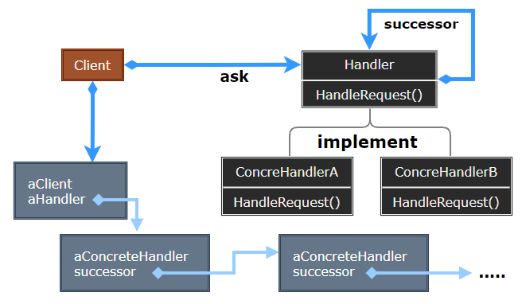
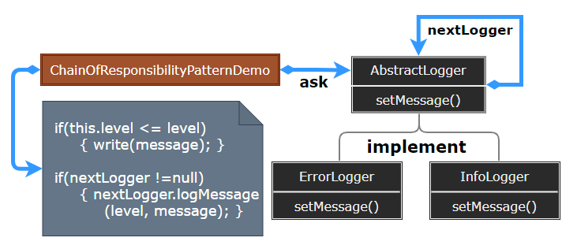

### Chain of Responsibility

责任链模式（Chain of Responsibility）为请求创建了一个接收者对象的链，使多个对象都有机会处理请求，从而避免请求的发送者和接收者之间的耦合关系。

  

- Handler：定义一个处理请求的接口，可实现为后继链的形式。
- ConcreteHandler：处理它所负责的请求，可访问它的后继者；若可处理该请求则处理之，否则将转发给它的后继者。
- Client：向链上的具体处理者 ConcreteHandler 对象提交请求。

> **设计要点**

1. 责任链模式的应用场合在于 "一个请求可能有多个接受者，但是最后真正的接受者只有一个"，目的是将请求发送者与接受者解耦。
2. 应用责任链模式后，对象的职责分派将更具灵活性，可以在运行时动态添加/修改请求的处理职责。
3. 如果请求传递到职责链的末尾仍得不到处理，应该有一个合理的缺省机制。

> **案例实现**

创建抽象类 AbstractLogger，带有详细的日志记录级别。然后创建三种类型的记录器，都扩展了 AbstractLogger。每个记录器判断消息的级别是否属于自己的级别，如果是则相应地打印出来，否则将消息传给下一个记录器。

  
  
  
  
  
  
  

---
