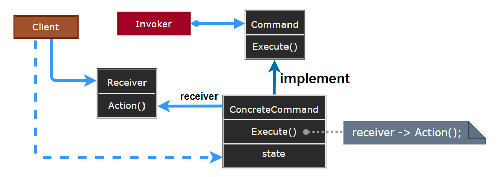
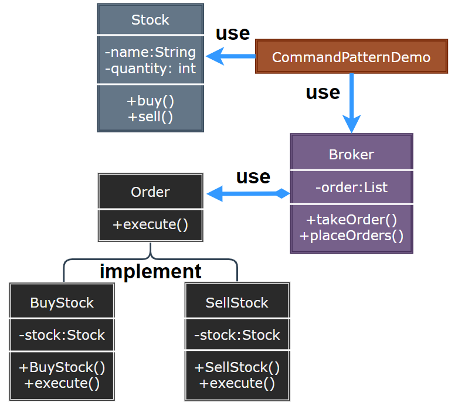

### Command

命令模式（Command）将一个请求封装为一个对象，从而使你可用不同的请求对客户进行参数化；对请求排队或记录请求日志，以及支持可撤销的操作。

  

- Command：声明执行操作的接口。
- ConcreteCommand：将一个接收者对象绑定于一个动作，调用接收者相应的操作，以实现 Execute。
- Client：创建一个具体命令对象并设定它的接收者。
- Invoker：要求该命令执行这个请求。
- Receiver：知道如何实施与执行一个请求相关的操作。

> **设计要点**

1. 命令模式的本质是将请求封装成对象，以便使用不同的请求参数化客户端。
2. 命令模式使得请求的发送者和接收者完全解耦，发送者只需要知道如何发送命令，而不需要知道命令是如何实现的。
3. 命令模式支持撤销操作，可以通过保存命令的历史记录来实现。

> **案例实现**

一个仓库采购系统，通过订购货物或取消货物命令，来管理仓库的货物库存。

  
  
  
  
  
  
  

---
