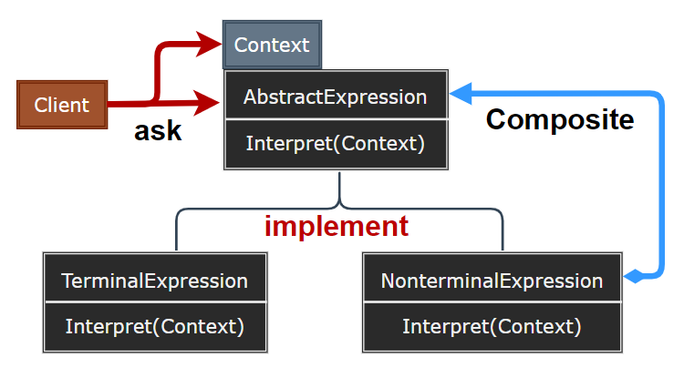
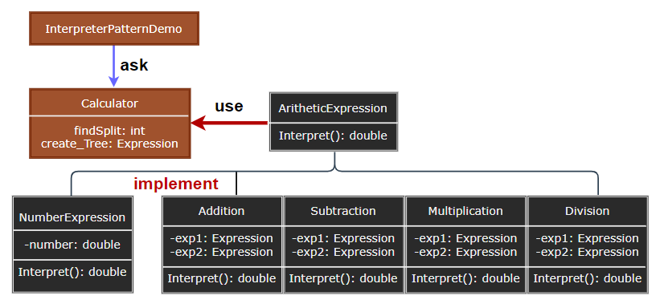

### Interpreter

解释器模式（Interpreter）给定一个语言，定义它的文法的一种表示，并定义一个解释器，这个解释器使用该表示来解释语言中的句子。

  

- AbstractExpression：声明一个抽象的解释操作，这个接口为所有具体表达式角色所共享。
- TerminalExpression：实现与文法中的终结符相关联的解释操作。
- NonterminalExpression：实现与文法中的非终结符相关联的解释操作。
- Context：包含解释器之外的一些全局信息。
- Client：构建（或被给定）表示该文法定义的语言中一个特定句子的抽象语法树，调用解释操作。

> **设计要点**

1. 解释器模式的核心是将语言的文法规则表示为一个抽象语法树，然后通过解释器来解释这个语法树。
2. 解释器模式适用于简单的语言和表达式，对于复杂的语言，可能会导致类的数量爆炸。
3. 解释器模式可以与组合模式结合使用，以表示复杂的语法结构。

> **案例实现**

创建一个简单的算术表达式解释器，它可以解析和计算包含加、减、乘、除运算的表达式。

  
  
  
  
  
  
  

---
