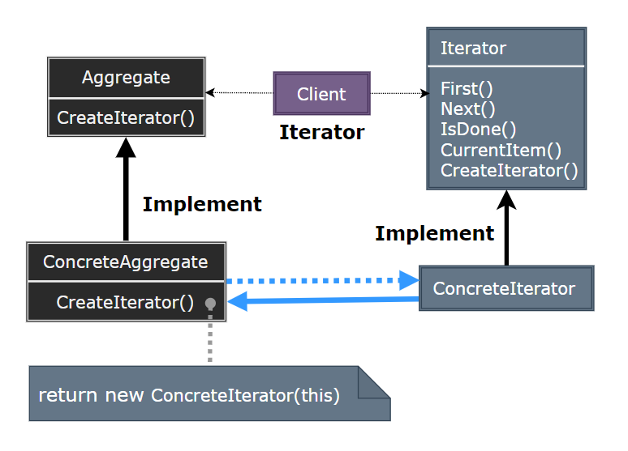
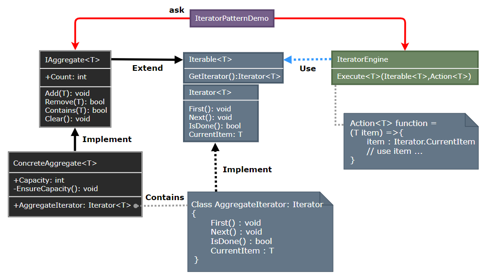

### Iterator

迭代器模式（Iterator）提供一种方法顺序访问一个聚合对象中各个元素，而又不暴露该对象的内部表示。

  

- Iterator：定义访问和遍历元素的接口。
- ConcreteIterator：实现迭代器接口，对该聚合遍历时跟踪当前位置。
- Aggregate：定义创建相应迭代器对象的接口。
- ConcreteAggregate：实现创建相应迭代器的接口，返回一个合适的 ConcreteIterator 实例。

> **设计要点**

1. 迭代器模式的核心是将聚合对象的遍历操作与聚合对象本身分离，使得遍历操作可以独立于聚合对象的结构。
2. 迭代器模式提供了一种统一的方式来遍历不同类型的聚合对象，客户端可以使用相同的代码来遍历不同的聚合。
3. 迭代器模式可以与组合模式结合使用，以遍历复杂的树形结构。

> **案例实现**

创建一个集合类，它可以存储多个元素，并提供一个迭代器来遍历这些元素。

  
  
  
  
  
  
  

---
