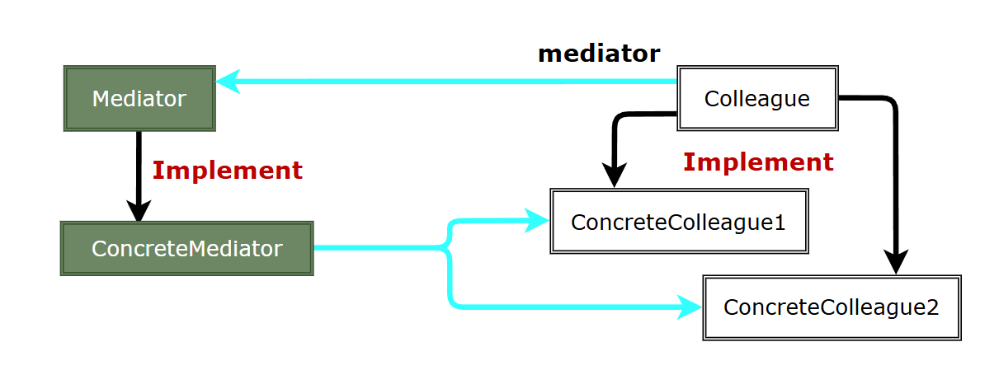
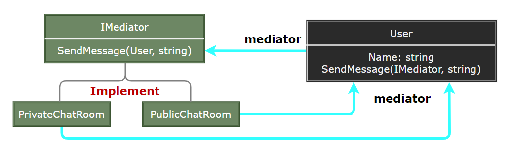

### Mediator

中介者模式（Mediator）用一个中介对象来封装一系列的对象交互，中介者使各对象不需要显式地相互引用，从而使其耦合松散，而且可以独立地改变它们之间的交互。

  

- Mediator：定义一个接口用于与各同事对象通信。
- ConcreteMediator：实现中介者接口，协调各同事对象实现协作行为。
- Colleague：定义各同事对象共有的接口。
- ConcreteColleague：实现同事接口，与其他同事对象通过中介者进行通信。

> **设计要点**

1. 中介者模式的核心是将多个对象之间的复杂交互集中到一个中介者对象中，从而简化对象之间的通信。
2. 中介者模式使得对象之间的耦合度降低，当需要修改对象之间的交互时，只需要修改中介者对象即可。
3. 中介者模式可以与观察者模式结合使用，以实现更复杂的对象间通信。

> **案例实现**

创建一个聊天室，多个用户可以在聊天室中发送消息，消息通过聊天室中介者传递给其他用户。

  
  
  
  
  
  
  

---
