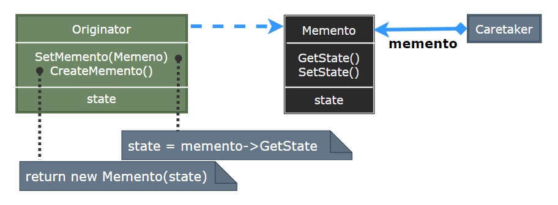
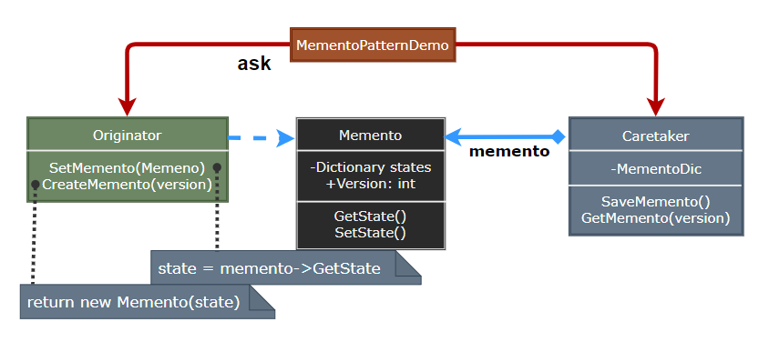

### Memento

备忘录模式（Memento）在不破坏封装性的前提下，捕获一个对象的内部状态，并在该对象之外保存这个状态，以便在需要时恢复该对象到原先保存的状态。

  

- Originator：创建一个备忘录，用于记录当前时刻的内部状态，并可使用备忘录恢复内部状态。
- Memento：存储 Originator 的内部状态，根据 Originator 的要求提供这些状态。
- Caretaker：负责保存好备忘录，不能对备忘录的内容进行操作或检查。

> **设计要点**

1. 备忘录模式的核心是将对象的状态保存到一个外部对象中，以便在需要时恢复对象的状态。
2. 备忘录模式可以与命令模式结合使用，以实现命令的撤销操作。
3. 备忘录模式可以与原型模式结合使用，以简化备忘录的创建和恢复过程。

> **案例实现**

设计一个状态备忘录，它可以保存当前的状态，并在需要时恢复到之前的状态。

  
  
  
  
  
  
  

---
