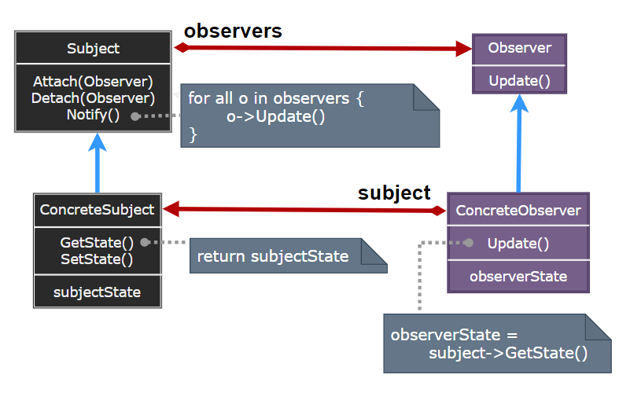
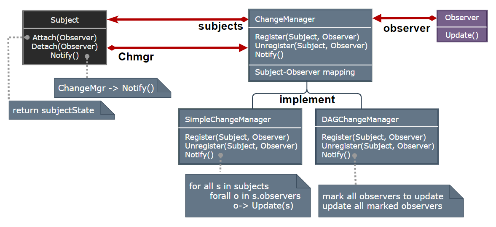

### Observer

观察者模式（Observer）定义对象间的一种一对多依赖关系，使得每当一个对象状态发生变化时，其相关依赖对象都得到通知并被自动更新。

  

- Subject：目标对象，它维护一个观察者列表，并提供添加和删除观察者的方法。
- Observer：观察者接口，定义了更新方法，当目标对象状态变化时被调用。
- ConcreteSubject：具体目标对象，当状态发生变化时，通知所有注册的观察者。
- ConcreteObserver：具体观察者，实现观察者接口，响应目标对象的状态变化。

> **设计要点**

1. 观察者模式的核心是建立对象之间的一对多依赖关系，当一个对象状态变化时，所有依赖它的对象都能得到通知。
2. 观察者模式可以与中介者模式结合使用，以实现更复杂的对象间通信。
3. 观察者模式可以与命令模式结合使用，以实现命令的撤销操作。

> **案例实现**

创建一个用户注册管理器，当有注册用户时，所有注册的观察者（如用户列表、用户通知等）都会得到通知并更新显示。用户登陆时，也会得到通知并更新显示。

  
  
  
  
  
  
  

---
