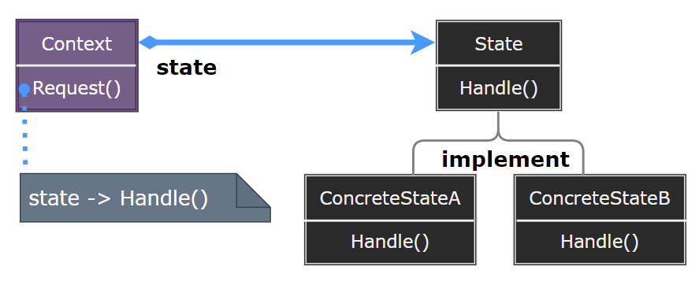
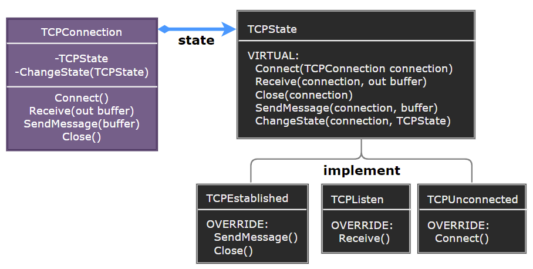

### State

状态模式（State）允许对象在内部状态改变时改变它的行为，对象看起来似乎修改了它的类。

  

- Context：定义客户端感兴趣的接口，维护一个 ConcreteState 子类的实例，这个实例定义当前状态。
- State：定义一个接口，用以封装与 Context 的一个特定状态相关的行为。
- ConcreteState：实现与 Context 的一个特定状态相关的行为。

> **设计要点**

1. 状态模式的核心是将对象的状态封装成独立的类，并在对象状态变化时切换到不同的状态类。
2. 状态模式可以与策略模式结合使用，以实现更复杂的行为切换。
3. 状态模式可以与单例模式结合使用，以减少状态对象的创建。

> **案例实现**

创建一个电梯系统，电梯可以处于不同的状态（如停止、运行、开门、关门等），当电梯的状态变化时，它的行为也会相应地改变。

  
  
  
  
  
  
  

---
