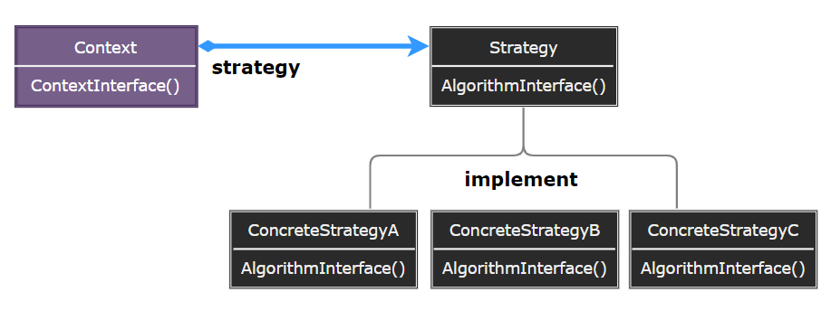
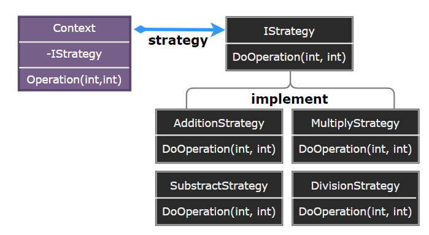

### Strategy

策略模式（Strategy）定义一系列的算法，把它们一个个封装起来，并且使它们可相互替换。本模式使得算法可独立于使用它的客户而变化。

  

- Strategy：定义所有支持的算法的公共接口。
- ConcreteStrategy：实现 Strategy 接口的具体算法。
- Context：使用一个 Strategy 对象来配置，维护一个对 Strategy 对象的引用。

> **设计要点**

1. 策略模式的核心是将算法封装成独立的类，使得算法可以独立于使用它的客户而变化。
2. 策略模式可以与工厂模式结合使用，以创建合适的策略对象。
3. 策略模式可以与模板方法模式结合使用，以实现更复杂的算法结构。

> **案例实现**

创建一个排序系统，它可以使用不同的排序算法（如冒泡排序、快速排序、插入排序等）来对数据进行排序。

  
  
  
  
  
  
  

---
