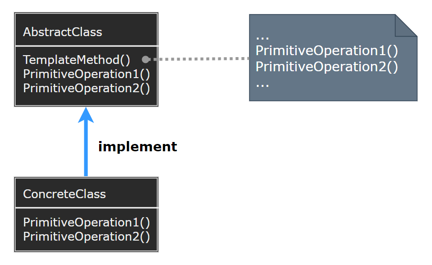
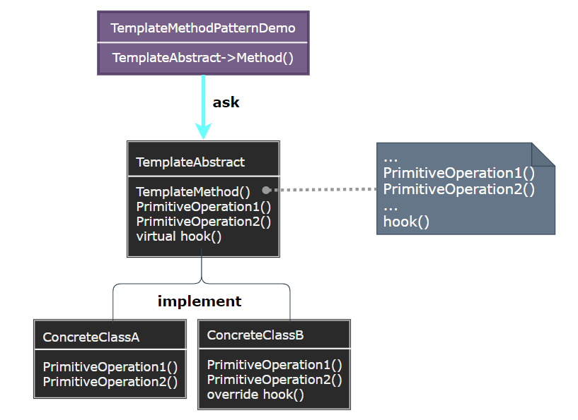

### Template Method

模板方法模式（Template Method）定义一个操作中的算法的骨架，而将一些步骤延迟到子类中。模板方法使得子类可以不改变一个算法的结构即可重定义该算法的某些特定步骤。

  

- AbstractClass：定义抽象的原语操作，具体的子类将重定义它们以实现一个算法的各步骤。
- ConcreteClass：实现原语操作以完成算法中与特定子类相关的步骤。

> **设计要点**

1. 模板方法模式的核心是在父类中定义算法的骨架，而将具体的实现延迟到子类中。
2. 模板方法模式可以与策略模式结合使用，以实现更灵活的算法选择。
3. 模板方法模式可以与工厂方法模式结合使用，以创建合适的对象。

> **案例实现**

创建一个饮料制作系统，它可以制作不同类型的饮料（如咖啡、茶等）。制作饮料的过程包括烧水、冲泡、倒入杯子、添加调料等步骤，其中烧水和倒入杯子是相同的，而冲泡和添加调料则因饮料类型而异。

  
  
  
  
  
  
  

---
