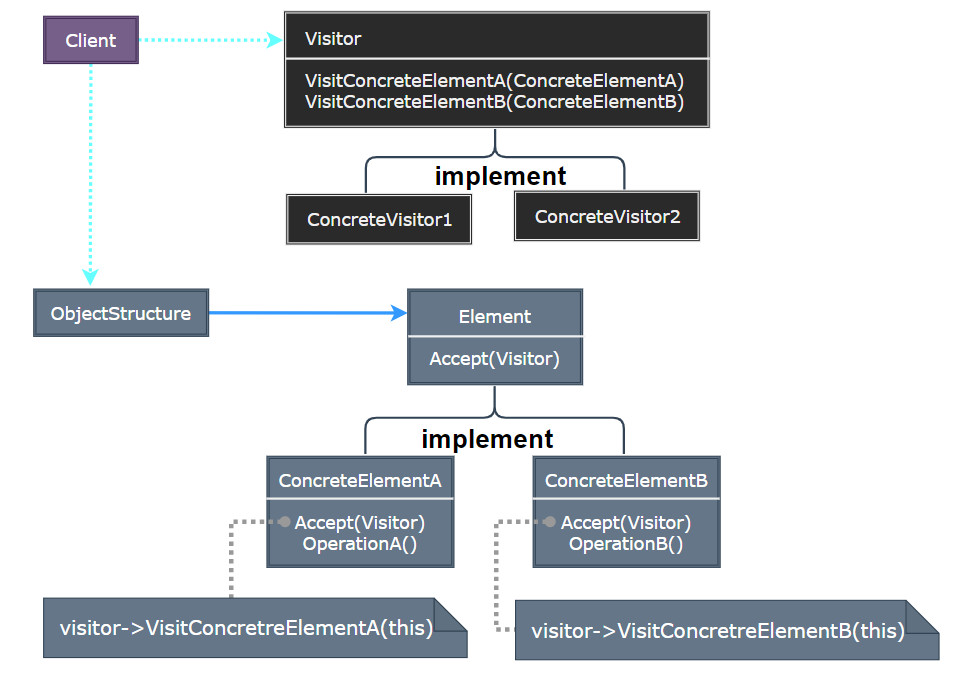
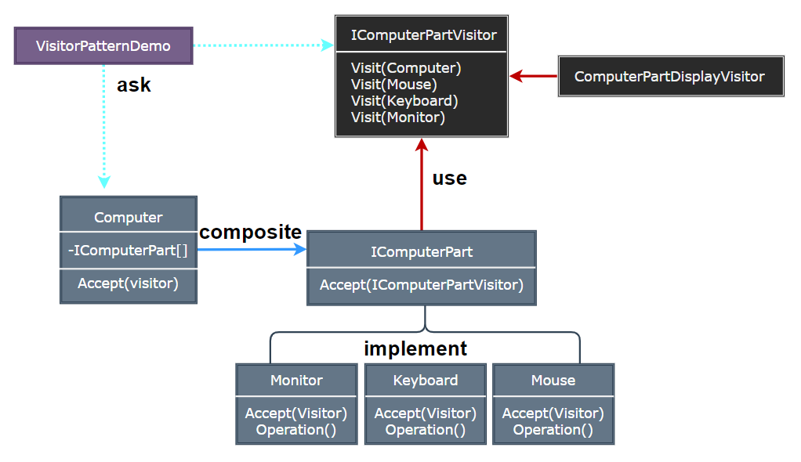

### Visitor

访问者模式（Visitor）表示一个作用于某对象结构中的各元素的操作，它使你可以在不改变各元素的类的前提下定义作用于这些元素的新操作。

  

- Visitor：为该对象结构中 ConcreteElement 的每一个类声明一个 Visit 操作。
- ConcreteVisitor：实现 Visitor 接口中为每一个 ConcreteElement 类声明的操作。
- Element：定义一个 Accept 操作，它以一个访问者为参数。
- ConcreteElement：实现 Accept 操作，调用访问者对应的 Visit 操作。
- ObjectStructure：可以遍历结构中的所有元素，提供一个高层接口，允许访问者访问元素。

> **设计要点**

1. 访问者模式的核心是将操作与元素分离，使得操作可以独立于元素的结构而变化。
2. 访问者模式可以与组合模式结合使用，以遍历复杂的对象结构。
3. 访问者模式可以与命令模式结合使用，以实现更复杂的操作。

> **案例实现**

创建一个购物车系统，它可以计算不同类型商品的价格。不同类型的商品（如书籍、电子产品、食品等）有不同的价格计算方式，访问者模式可以在不修改商品类的情况下添加新的价格计算方式。
创建一个电脑系统，电脑的组件和访问者模式的元素对应，电脑的组件有不同的访问者，每个访问者都有自己的操作。

  
  
  
  
  
  
  

---
