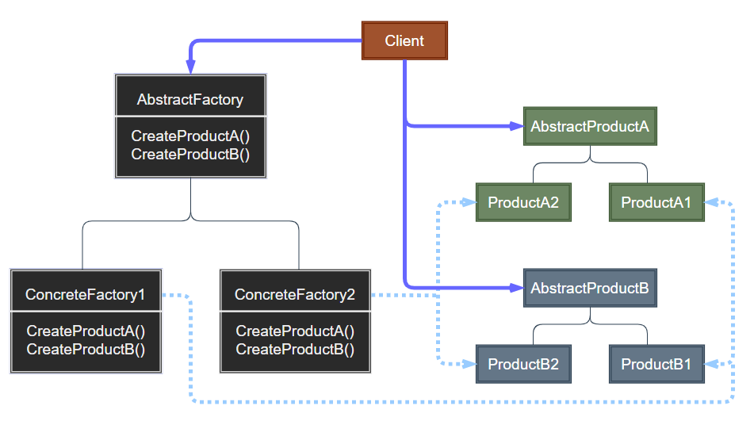
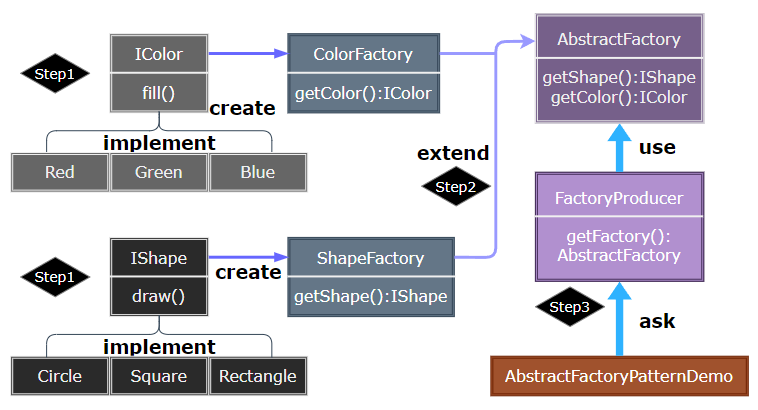

### Abstract Factory

抽象工厂模式（Abstract Factory）提供一个创建一系列相互依赖对象的接口，而无需指定它们具体的类。主要解决多系列对象创建的紧耦合问题，实现产品族的统一创建。

> **Abstract Factory 抽象工厂设计示意**

  

- AbstractFactory：声明一个创建抽象产品对象的操作接口。
- ConcreteFactory：实现创建具体产品对象的操作。
- AbstractProduct：为一类产品对象对应声明一个接口。
- ConcreteProduct：定义一个将被相应的具体工厂创建的产品对象，实现 AbstractProduct 接口。
- Client：仅使用由 AbstractFactory 和 AbstractProduct 类声明的接口。

> **设计要点**

1. 如果没有应对 “多系列对象构建” 的需求变化，则没有必要使用 AbstractFactory 模式，这时候使用 Factory 完全可以。
2. AbstractFactory 主要在于应对 “新系列” 的需求变动。其缺点在于难以应对 “新对象” 的需求变动。
3. AbstractFactory 模式经常和 Factory 模式共同组合来应对 “对象创建” 的需求变化。

> **案例实现**

绘制一个图形，这个图形有特定形状和特定的颜色组合。抽象形状和颜色的绘制方法，由子类 Factory 负责组合和实现。

  
  
  
  
  
  
  

---
