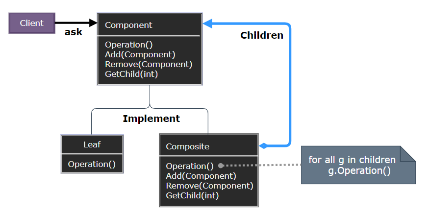
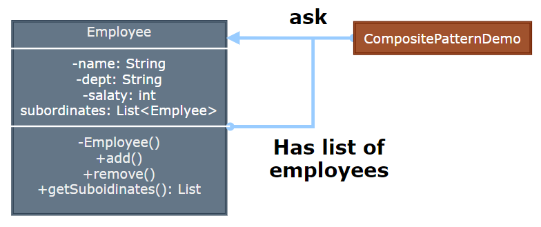

### Composite

组合模式（Composite）将对象组合成树形结构以表示 "部分-整体" 的层次结构，使得客户端对单个对象和组合对象的使用具有一致性。

  

- Component：定义组合中对象的接口，声明用于访问和管理子组件的操作。
- Leaf：表示组合中的叶节点对象，没有子节点。
- Composite：表示组合中的分支节点对象，包含子节点。

> **设计要点**

1. 组合模式适用于处理树形结构，使得客户端可以统一处理单个对象和组合对象。
2. 通过递归组合，可以构建复杂的树形结构，同时保持接口的一致性。
3. 简化了客户端代码，因为客户端不需要区分处理的是单个对象还是组合对象。

> **案例实现**

实现一个公司组织架构的树形结构，包含部门和员工，通过组合模式统一处理。

  

  
  
  
  
  
  
  <!--  -->

---