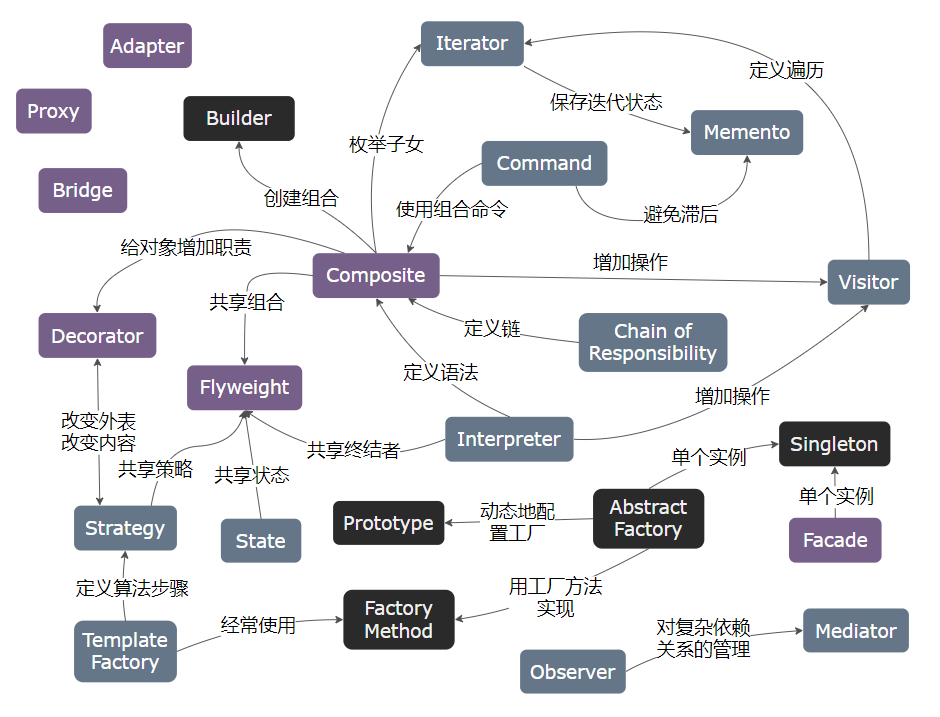

## GOF23

### 1. 创建型模式

| Patterns                                                            | Description                                                |
| :------------------------------------------------------------------ | :--------------------------------------------------------- |
| [Abstract Factory](./01_GOF23/01_创建型模式/01_AbstractFactory.md) | **抽象工厂**：提供一个创建一组相关或依赖对象族的抽象接口   |
| [Builder]( ./01_GOF23/01_创建型模式/02_Builder.md)                 | **建造者**：将一个复杂对象的构建与它的表示分离             |
| [Factory Method]( ./01_GOF23/01_创建型模式/03_Factory.md)          | **工厂方法**：定义一个创建对象的接口，由子类决定实例化对象 |
| [Prototype]( ./01_GOF23/01_创建型模式/04_Prototype.md)             | **原型**：复制现有的对象原型来创建新对象                   |
| [Singleton]( ./01_GOF23/01_创建型模式/05_Singleton.md)             | **单例**：确保一个类仅有一个实例和唯一全局访问点。         |

>---

### 2. 结构型模式

| Patterns                                                               | Description                                                                                                                    |
| :--------------------------------------------------------------------- | :----------------------------------------------------------------------------------------------------------------------------- |
| [Adapter](./Contents/StructuralPatterns/_01_Adapter_适配器模式.md)     | **适配器**：将一个类的接口转换成客户希望的另外一个接口，Adapter 模式使得原本由于接口不兼容而不能一起工作的那些类可以一起工作。 |
| [Bridge](./Contents/StructuralPatterns/_02_Bridge_桥接模式.md)         | **桥接**：将抽象部分与它的实现部分分离，使它们都可以独立地变化。                                                               |
| [Composite](./Contents/StructuralPatterns/_03_Composite_组合模式.md)   | **组合**：将对象组合成树形结构以表示 “部分整体” 的层次结构。Composite 使得客户对单个对象和复合对象的使用具有一致性。           |
| [Decorator](./Contents/StructuralPatterns/_04_Decorator_装饰器模式.md) | **装饰**：动态地给一个对象添加一些额外的职责。就扩展功能而言，Decorator 模式比生成子类方式更为灵活。                           |
| [Facade](./Contents/StructuralPatterns/_05_Facade_外观模式.md)         | **外观**：为子系统中的一组接口提供一个一致的界面，Facade 模式定义了一个高层接口，这个接口使得这一子系统更加容易使用。          |
| [Flyweight](./Contents/StructuralPatterns/_06_Flyweight_享元模式.md)   | **享元**：运用共享技术有效地支持大量细粒度的对象。                                                                             |
| [Proxy](./Contents/StructuralPatterns/_07_Proxy_代理模式.md)           | **代理**：为其他对象提供一个代理以控制对这个对象的访问。                                                                       |

>---

### 3. 行为型模式

| Patterns                                                                                         | Description                                                                                                                                              |
| :----------------------------------------------------------------------------------------------- | :------------------------------------------------------------------------------------------------------------------------------------------------------- |
| [Chain of Responsibility](./Contents/BehavioralPatterns/_01_ChainOfResponsibility_责任链模式.md) | **责任链**：为解除请求的发送者和接收者之间的耦合，而使多个对象都有机会处理这个请求。将这些对象连成一条链，并沿着这条链传递该请求，直到有一个对象处理它。 |
| [Command](./Contents/BehavioralPatterns/_02_Command_命令模式.md)                                 | **命令**：将一个请求封装为一个对象，从而使你可用不同的请求对客户进行参数化；对请求排队或记录请求日志，以及支持可取消的操作。                             |
| [Interpreter](./Contents/BehavioralPatterns/_03_Interpreter_解释器模式.md)                       | **解释器**：给定一个语言，定义它的文法的一种表示，并定义一个解释器，该解释器使用该表示来解释语言中的句子。                                               |
| [Iterator](./Contents/BehavioralPatterns/_04_Iterator_迭代器模式.md)                             | **迭代器**：提供一种方法顺序访问一个聚合对象中各个元素，而又不需暴露该对象的内部表示。                                                                   |
| [Mediator](./Contents/BehavioralPatterns/_05_Mediator_中介者模式.md)                             | **中介者**：用一个中介对象来封装一系列的对象交互。中介者使各对象不需要显式地相互引用，从而使其耦合松散，而且可以独立地改变它们之间的交互。               |
| [Memento](./Contents/BehavioralPatterns/_06_Memento_备忘录模式.md)                               | **备忘录**：在不破坏封装性的前提下，捕获一个对象的内部状态，并在该对象之外保存这个状态。这样以后就可将该对象恢复到保存的状态。                           |
| [Observer](./Contents/BehavioralPatterns/_07_Observer_观察者模式.md)                             | **观察者**：定义对象间的一种一对多的依赖关系，以便当一个对象的状态发生改变时，所有依赖于它的对象都得到通知并自动刷新。                                   |
| [State](./Contents/BehavioralPatterns/_08_State_状态模式.md)                                     | **状态**：允许一个对象在其内部状态改变时改变它的行为。对象看起来似乎修改了它所属的类。                                                                   |
| [Strategy](./Contents/BehavioralPatterns/_09_Strategy_策略模式.md)                               | **策略**：定义一系列的算法把它们一个个封装起来，并且使它们可相互替换。本模式使得算法的变化可独立于使用它的客户。                                         |
| [Template Method](./Contents/BehavioralPatterns/_10_TemplateMethod_模板方法模式.md)              | **模板方法**：定义一个操作中的算法的骨架，而将一些步骤延迟到子类中。Template Method 使得子类可以不改变一个算法的结构即可重定义该算法的某些特定步骤。     |
| [Visitor](./Contents/BehavioralPatterns/_11_Visitor_访问者模式.md)                               | **访问者**：表示一个作用于某对象结构中的各元素的操作。它使你可以在不改变各元素的类的前提下定义作用于这些元素的新操作。                                   |

>---

### 4. 设计模式之间的关系

---