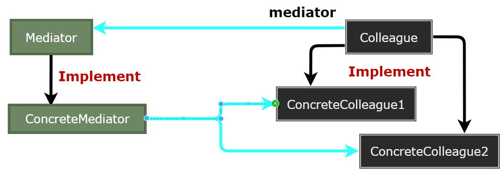

## Mediator Pattern

---
### 中介者模式 (Mediator)

中介者模式 (Mediator Pattern) 是用来降低多个对象和类之间的通信复杂性。这种模式提供了一个中介类，该类通常处理不同类之间的通信，并支持松耦合，使代码易于维护。中介者模式属于行为型模式。

> **意图**

- 意图：用一个中介对象来封装—系列的对象交互。
- 主要解决：对象与对象之间存在大量的关联关系，这样势必会导致系统的结构变得很复杂，同时若一个对象发生改变，我们也需要跟踪与之相关联的对象，同时做出相应的处理。

> **动机**

在软件构建过程中，经常会出现多个对象互相关联交互的情况，对象之间常常会维持一种复杂的引用关系，如果遇到一些需求的更改，这种直接的引用关系将面临不断的变化。

在这种情况下，我们可使用一个 “中介对象” 来管理对象间的关联关系，避免相互交互的对象之间的紧耦合引用关系，从而更好地抵御变化。

> **适用性**

- 一组对象以定义良好但是复杂的方式进行通信。产生的相互依赖关系结构混乱且难以理解。
- 一个对象引用其他很多对象并且直接与这些对象通信，导致难以复用该对象。
- 想定制一个分布在多个类中的行为，而又不想生成太多的子类。

>---
### 模式设计

> **中介者模式**

  

> **参与者**

- Mediator：中介者定义一个接口用于与各同事 (Colleague) 对象通信。
- ConcreteMediator：具体中介者通过协调各同事对象实现协作行为；了解并维护它的各个同事。
- Colleague Class：每一个同事类都知道它的中介者对象；每一个同事对象在需与其他的同事通信的时候，与它的中介者通信。

> **协作**

- 同事向一个中介者对象发送和接收请求。中介者在各同事间适当地转发请求以实现协作行为。

#### 模式实现

1. 忽略抽象的 Mediator 类：考虑 Colleague 间的交互转移，无需创建抽象的 Mediator。
2. Colleague—Mediator 通信：使用 Observer 模式，将 Mediator 实现为一个 Observer，各 Colleague 作为 Subject，一旦其状态改变就发送通知给 Mediator。Mediator 作出的响应是将状态改变的结果传播给其他的 Colleague。或在 Mediator 中定义一个特殊的通知接口，各 Colleague 在通信时直接调用该接口。

> **设计要点**

- 将多个对象间复杂的关联关系解耦，Mediator 模式将多个对象间的控制逻辑进行集中管理，变 “多个对象互相关联” 为 “多个对象和一个中介者关联”，简化了系统的维护，抵御了可能的变化。
- 随着控制逻辑的复杂化，Mediator 具体对象的实现可能相当复杂。这时候可以对 Mediator 对象进行分解处理。
- Facade 模式是解耦系统外到系统内 (单向) 的对象关联关系; Mediator 模式是解耦系统内各个对象之间 (双向) 的关联关系。

#### 中介者模式优缺点

1. 减少了子类生成：Mediator 将原本分布于多个对象间的行为集中在一起，而改变行为只需要生成 Mediator 子类。
2. 将各 Colleague 解耦：可独立改变各 Colleague 与 Mediator 类。
3. 简化了对象协议：用一对多的交互代替多对多的交互。
4. 对对象如何协作进行了抽象：中介者将注意力从对象各自本身的行为转移到它们在 Mediator 之间的交互上来。
5. 使控制集中化：中介者将交互的复杂性变为中介者的复杂性。

>---
### 案例实现

通过聊天室实例来演示中介者模式。实例中，多个用户可以向聊天室发送消息，聊天室向所有的用户显示消息。将创建两个类 ChatRoom 和 User。User 对象使用 ChatRoom 方法来分享他们的消息。

MediatorPatternDemo，我们的演示类使用 User 对象来显示他们之间的通信。

> **案例示意**

  

> **代码实现**

- [C# 实现](../../CodeDemo/DesignPatterns%20For%20CSharp/Behavioral%20Patterns/Mediator/Mediator.cs)

>---
### 相关模式

- Facade 与中介者的不同之处在于它是对一个对象子系统进行抽象，从而提供了一个更为方便的接口。它的协议是单向的，即 Facade 对这个子系统类提出请求，但反之则不行。
- Mediator 提供了各 Colleague 对象不支持或不能支持的协作行为，而且协议是多向的。
- Colleague 可使用 Observer 模式与 Mediator 通信。

---