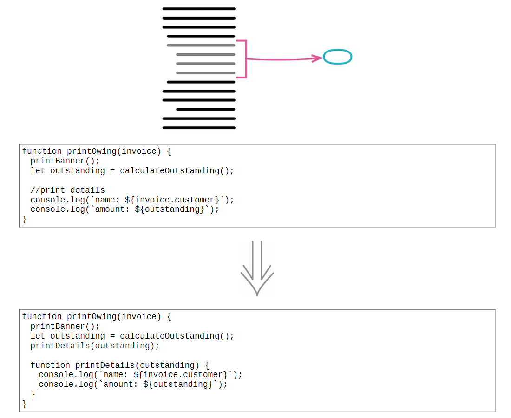
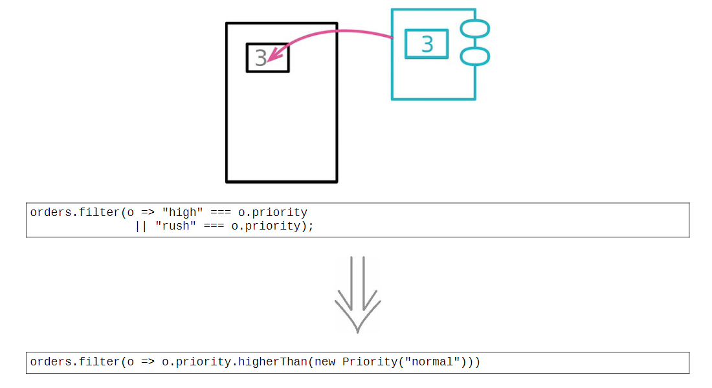
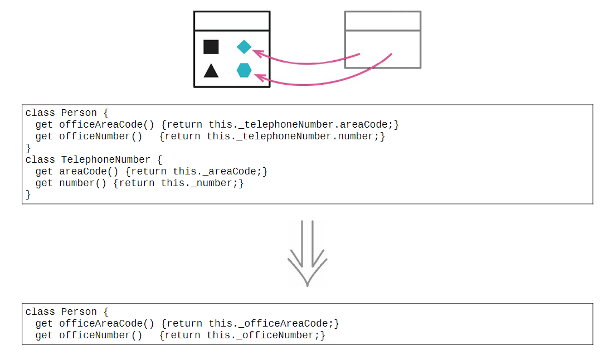

### 重构名录

---
#### 提炼函数（Extract Function）

将意图与实现分开：如果需要花时间浏览一段代码才能弄清它到底在干什么，那么就应该将其提炼到一个函数中，并根据它所做的事为其命名。

>---
#### 内联函数（Inline Function）

某些间接函数，其内部代码和函数名称同样清晰易读。应该去掉这个函数，直接使用其中的代码。

>---
#### 提炼变量（Extract Variable）

表达式有可能非常复杂而难以阅读。这种情况下，提炼表达式为局部变量可以帮助我们将表达式分解为比较容易管理的形式。

>---
#### 内联变量（Inline Variable）

在一个函数内部，变量能给表达式提供有意义的名字。但有时候，这个名字并不比表达式本身更具表现力。

>---
#### 改变函数声明（Change Function Declaration）

函数是将程序拆分成小块的主要方式。函数声明则展现了如何将这些小块组合在一起工作，它们就是软件系统的关节。对于这些关节而言，最重要的元素当属函数的名字。函数的参数列表阐述了函数如何与外部世界共处，修改参数列表不仅能增加函数的应用范围，还能改变连接一个模块所需的条件，从而去除不必要的耦合。

>---
#### 封装变量（Encapsulate Variable）

如果想要搬移一处被广泛使用的数据，最好的办法往往是先以函数形式封装所有对该数据的访问。对于所有可变的数据，只要它的作用域超出单个函数，就将其封装起来，只允许通过函数访问。

>---
#### 变量改名（Rename Variable）

好的命名是整洁编程的核心。变量可以很好地解释一段程序在干什么：

>---
#### 引入参数对象（Introduce Parameter Object）

将数据组织成结构是一件有价值的事，因为这让数据项之间的关系变得明晰。使用新的数据结构，参数的参数列表也能缩短。创建一个合适的数据结构。使用 *改变函数声明* 给原来的函数新增一个参数，类型是新建的数据结构。

>---
#### 函数组合成类（Combine Functions into Class）

类把数据与函数捆绑到同一个环境中，将一部分数据与函数暴露给其他程序元素以便协作。如果发现一组函数形影不离地操作同一块数据（通常是将这块数据作为参数传递给函数），是时候组建一个类了。将函数组织到一起的另一种方式是 *函数组合成变换*。

>---
#### 函数组合成变换（Combine Functions into Transform）

在软件中，经常需要把数据 “喂” 给一个程序，让它再计算出各种派生信息。一个方式是采用数据变换函数：这种函数接受源数据作为输入，计算出所有的派生数据，将派生数据以字段形式填入输出数据。函数组合成变换的替代方案是 *函数组合成类*。

>---
#### 拆分阶段（Split Phase）

每当看见一段代码在同时处理两件不同的事，就可以把它拆分成各自独立的模块。最简洁的拆分方法之一，就是把一大段行为分成顺序执行的两个阶段。

>---
#### 封装记录（Encapsulate Record）

记录型结构能直观地组织起存在关联的数据，可以有两种类型：一种需要声明合法的字段名称，另一种可以任意使用字段名称（例如散列、映射、散列映射、字典或关联数组等）。程序中间常常需要互相传递嵌套的列表（list）或散列映射结构，这些数据结构后续经常需要被序列化成 JSON 或 XML。

>---
### 封装集合（Encapsulate Collection）

不在模块以外直接修改集合，而仅仅提供这些修改方法。一种避免直接修改集合的方法是，永远不直接返回集合的值。另一种方法是，以某种形式限制集合的访问权，只允许对集合进行读操作。

>---
#### 以对象取代基本类型（Replace Primitive with Object）

开发初期往往决定以简单的数据项表示简单的情况，但随着开发的进行，这些简单数据项不再那么简单了。这类逻辑很快便会占领代码库，制造出许多重复代码，增加使用时的成本。为这些数据项进行封装。

>---
#### 以查询取代临时变量（Replace Temp with Query）

临时变量的一个作用是保存某段代码的返回值。*以查询取代临时变量* 手法只适用于处理某些类型的临时变量：那些只被计算一次且之后不再被修改的变量。对于那些做快照用途的临时变量（从变量名往往可见端倪，比如 oldAddress 的名字），就不能使用本手法。

>---
#### 提炼类（Extract Class）

设想有一个维护大量函数和数据的类，这样的类往往因为太大而不易理解。此时需要考虑哪些部分可以分离出去，并将它们分离到一个独立的类中。如果某些数据和某些函数总是一起出现，某些数据经常同时变化甚至彼此相依，这就表示应该将它们分离出去。

>---
#### 内联类（Inline Class）

内联类正好与 *提炼类* 相反，如果一个类不再承担足够责任，则不再有单独存在的理由。

>---
#### 隐藏委托关系（Hide Delegate）

“封装” 意味着每个模块都应该尽可能少了解系统的其他部分，封装意味着应该隐藏自己的字段。如果某些客户端先通过服务对象的字段得到另一个对象（受托类），然后调用后者的函数，那么客户就必须知晓这一层委托关系。

>---
#### 移除中间人（Remove Middle Man）

每当客户端要使用受托类的新特性时，就必须在服务端添加一个简单委托函数。随着受托类的特性（功能）越来越多，更多的转发函数就会使人烦躁。服务类完全变成了一个中间人，此时就应该让客户直接调用受托类。

>---
#### 替换算法（Substitute Algorithm）

使用替换算法之前，首先确定是否已经尽可能分解了原先的函数。替换一个巨大且复杂的算法是非常困难的，只有先将它分解为较简单的小型函数，才能很有把握地进行算法替换工作。

>---
#### 搬移函数（Move Function）

任何函数都需要具备上下文环境才能存活。这个上下文可以是全局的，但它更多时候是由某种形式的模块所提供的。搬移函数最直接的一个动因是，它频繁引用其他上下文中的元素，而对自身上下文中的元素却关心甚少。

>---
#### 搬移字段（Move Field）

如果修改一条记录时，总是需要同时改动另一条记录，那么说明很可能有字段放错了位置。总是一同出现、一同作为函数参数传递的数据，最好是规整（*搬移字段*）到同一条记录中，以体现它们之间的联系。

>---
#### 搬移语句到函数（Move Statements into Function）

调用某个函数时，总有一些相同的代码也需要每次执行，那么考虑将此段代码合并到函数里。

>---
#### 搬移语句到调用者（Move Statements to Callers）

函数边界发生偏移的一个征兆是，以往在多个地方共用的行为，如今需要在某些调用点面前表现出不同的行为。于是得把表现不同的行为从函数里挪出，并搬移到其调用处。

>---
#### 以函数调用取代内联代码（Replace Inline Code with Function Call）

函数有助于消除重复，因为同一段代码不需要编写两次，每次调用一下函数即可。一些内联代码，它们做的事情仅仅是已有函数的重复，应以一个函数调用取代内联代码。

>---
#### 移动语句（Slide Statements）

让存在关联的东西一起出现，可以使代码更容易理解。如果有几行代码取用了同一个数据结构，那么最好是让它们在一起出现，而不是夹杂在取用其他数据结构的代码中间。一种常见的 “关联” 是关于变量的声明和使用。

>---
#### 拆分循环（Split Loop）

在一次循环中做了两件不同的事，那么每当需要修改循环时，需要同时理解这两件事情。如果能够将循环拆分，让一个循环只做一件事情，那就能确保每次修改时只需要理解要修改的那块代码的行为就可以了。

>---
#### 以管道取代循环（Replace Loop with Pipeline）

集合管道允许使用一组运算来描述集合的迭代过程，其中每种运算接收的入参和返回值都是一个集合。最常见 map 和 filter：map 运算是指用一个函数作用于输入集合的每一个元素上，将集合变换成另外一个集合的过程；filter 运算是指用一个函数从输入集合中筛选出符合条件的元素子集的过程。

>---
#### 移除死代码（Remove Dead Code）

无用代码会带来很多额外的思维负担，一旦代码不再被使用，就该立马删除它。

>---
#### 拆分变量（Split Variable）

如果变量承担多个责任，它就应该被替换（分解）为多个变量，每个变量只承担一个责任。“循环变量” 和 “结果收集变量” 就是两个典型例子。

>---
#### 字段改名（Rename Field）

对于程序中广泛使用的记录结构和类，其中字段的命名格外重要。

>---
#### 以查询取代派生变量（Replace Derived Variable with Query）

可变数据是软件中最大的错误源头之一。有些变量其实可以很容易地随时计算出来。如果能去掉这些变量，也算朝着消除可变性的方向迈出了一大步。因此也避免了 “源数据修改时忘了更新派生变量” 的错误。

>---
#### 将引用对象改为值对象（Change Reference toValue）

在把一个对象（或数据结构）嵌入另一个对象时，位于内部的这个对象可以被视为引用对象，也可以被视为值对象。如果把一个字段视为值对象，可以把内部对象的类也变成值对象。

>---
#### 将值对象改为引用对象（Change Value to Reference）

如果共享的数据需要更新，将其复制多份的做法就会遇到巨大的困难。可以考虑将多份数据副本变成单一的引用，这样对数据的修改就会立即反映在所有引用中。对于一个客观实体，只有一个代表它的对象。

>---
#### 分解条件表达式（Decompose Conditional）

复杂的条件逻辑是最常导致复杂度上升的地点之一。对于条件逻辑，将每个分支条件分解成新函数。

>---
#### 合并条件表达式（Consolidate Conditional Expression）

检查条件各不相同，最终行为却一致，这种情况应该使用 “逻辑或” 和 “逻辑与” 将它们合并为一个条件表达式。

>---
#### 以卫语句取代嵌套条件表达式（Replace Nested Conditional with Guard Clauses）

如果某个条件极其罕见，就应该单独检查该条件，并在该条件为真时立刻从函数中返回。这样的单独检查常常被称为 “卫语句”。

>---
#### 以多态取代条件表达式（Replace Conditional with Polymorphism）

复杂的条件逻辑是编程中最难理解的东西之一，可以将条件逻辑拆分到不同的场景（或者叫高阶用例），从而拆解复杂的条件逻辑。使用类和多态能把逻辑的拆分表述得更清晰。

>---
#### 引入特例（Introduce Special Case）

一种常见的重复代码是这种情况：一个数据结构的使用者都在检查某个特殊的值，并且当这个特殊值出现时所做的处理也都相同。处理这种情况的一个好办法是使用 “特例” 模式。

>---
#### 引入断言（Introduce Assertion）

常常会有这样一段代码：只有当某个条件为真时，该段代码才能正常运行。可以使用断言明确标明这些假设。断言是一个条件表达式，应该总是为真。断言不应用来检查所有 “应该为真” 的条件，只用来检查 “必须为真” 的条件。

>---
#### 将查询函数和修改函数分离（Separate Query from Modifier）

任何有返回值的函数，都不应该有看得到的副作用 —— 命令与查询分离。如果遇到一个 “既有返回值又有副作用” 的函数，应尝试将查询动作从修改动作中分离出来。

>---
#### 函数参数化（Parameterize Function）

如果两个函数逻辑非常相似，只有一些字面量值不同，可以将其合并成一个函数，以参数的形式传入不同的值，从而消除重复。

>---
#### 移除标记参数（Remove Flag Argument）

调用者用标记参数来指示被调函数应该执行哪一部分逻辑，标记参数可能以枚举的形式出现。标记参数隐藏了函数调用中存在的差异性，不能清晰地传达其含义。如果明确用一个函数来完成一项单独的任务，其含义会清晰得多。

>---
#### 保持对象完整（Preserve Whole Object）

“传递整个记录” 的方式能更好地应对变化：如果将来被调的函数需要从记录中导出更多的数据，就不用为此修改参数列表。并且传递整个记录也能缩短参数列表，让函数调用更容易看懂。

>---
#### 以查询取代参数（Replace Parameter with Query）

函数的参数列表应该总结该函数的可变性，标示出函数可能体现出行为差异的主要方式。和任何代码中的语句一样，参数列表应该尽量避免重复，并且参数列表越短就越容易理解。

>---
#### 以参数取代查询（Replace Query with Parameter）

为了让目标函数不再依赖于某个元素，可以把这个元素的值以参数形式传递给该函数。如果把所有依赖关系都变成参数，会导致参数列表冗长重复；如果作用域之间的共享太多，又会导致函数间依赖过度。

>---
#### 移除设值函数（Remove Setting Method）

如果为某个字段提供了设值函数，这就暗示这个字段可以被改变。如果不希望在对象创建之后此字段还有机会被改变，那就不要为它提供设值函数（同时将该字段声明为不可变）。

>---
#### 以工厂函数取代构造函数（Replace Constructor with Factory Function）

构造函数专门用于对象的初始化，但只能返回当前所调用类的实例，无法根据环境或参数信息返回子类实例或代理对象。工厂函数就不受这些限制。

>---
#### 以命令取代函数（Replace Function with Command）

“命令对象” 将函数封装成自己的对象，这种对象大多只服务于单一函数。一些编程语言支持对象但不支持函数作为一等公民，通过命令对象就可以给函数提供大部分相当于一等公民的能力。

>---
#### 以函数取代命令（Replace Command with Function）

命令对象为处理复杂计算提供了强大的机制。借助命令对象，可以轻松地将原本复杂的函数拆解为多个方法，彼此之间通过字段共享状态；如果这个函数不是太复杂，那么命令对象可能显得费而不惠，应该考虑将其变回普通的函数。

>---
#### 函数上移（Pull Up Method）

避免重复代码是很重要的。如果某个函数在各个子类中的函数体都相同，适用函数上移。被提升的函数可能会引用只出现于子类而不出现于超类的特性。

>---
#### 字段上移（Pull Up Field）

判断若干字段是否重复，唯一的办法就是观察函数如何使用它们。如果它们被使用的方式很相似，就可以将它们提升到超类中去。

>---
#### 构造函数本体上移（Pull Up Constructor Body）

如果各个子类中的构造函数有共同行为，可以将他们提升至超类。

>---
#### 函数下移（Push Down Method）

如果超类中的某个函数只与一个（或少数几个）子类有关，那么最好将其从超类中挪走，放到真正关心它的子类中去。

>---
#### 字段下移（Push Down Field）

如果某个字段只被一个子类（或者一小部分子类）用到，就将其搬移到需要该字段的子类中。

>---
#### 以子类取代类型码（Replace Type Code with Subclasses）

表现分类关系的第一种工具是类型码字段 —— 根据具体的编程语言，可能实现为枚举、符号、字符串或者数字。如果有几个函数都在根据类型码的取值采取不同的行为，多态就显得特别有用。

>---
#### 移除子类（Remove Subclass）

子类很有用为数据结构的多样和行为的多态提供支持，随着软件的演化，子类所支持的变化可能会被搬移到别处，甚至完全去除，这时子类就失去了价值。有时添加子类是为了应对未来的功能，结果构想中的功能压根没被构造出来，或者用了另一种方式构造，使该子类不再被需要了。

>---
#### 提炼超类（Extract Superclass）

两个类在做相似的事，可以利用基本的继承机制把它们的相似之处提炼到超类。

>---
#### 折叠继承体系（Collapse Hierarchy）

随着继承体系的演化，有时会发现一个类与其超类已经没多大差别，不值得再作为独立的类存在。此时可以考虑把超类和子类合并起来。

>---
#### 以委托取代子类（Replace Subclass with Delegate）

继承给类之间引入了非常紧密的关系。在超类上做任何修改，都很可能破坏子类。与继承关系相比，使用委托关系时接口更清晰、耦合更少。

>---
#### 以委托取代超类（Replace Superclass with Delegate）

如果符合继承关系的语义条件（超类的所有方法都适用于子类，子类的所有实例都是超类的实例），那么继承是一种简洁又高效的复用机制。如果情况发生变化，继承不再是最好的选择，运用以委托取代超类。首先（尽量）使用继承，如果发现继承有问题，再使用以委托取代超类。

---